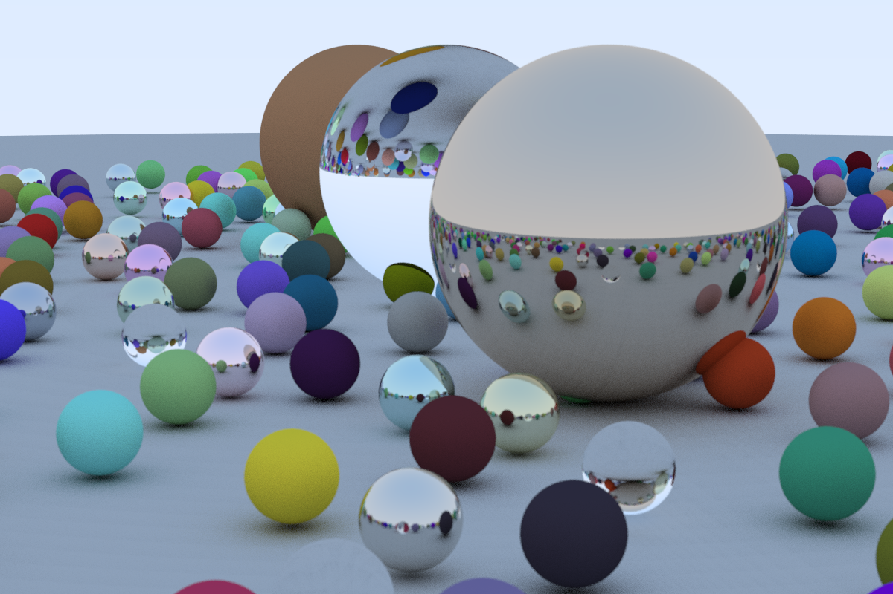

# **Y**et **A**nother **R**ay **T**racer

## Dependencies

- [Embree](https://embree.github.io/)
- [Eigen](http://eigen.tuxfamily.org/index.php?title=Main_Page)
- OpenMP(Optional)

## Features

- [x] [Embree](https://embree.github.io/) for high performance cpu ray/geometry intersection
- [x] OpenMP for parallelization

